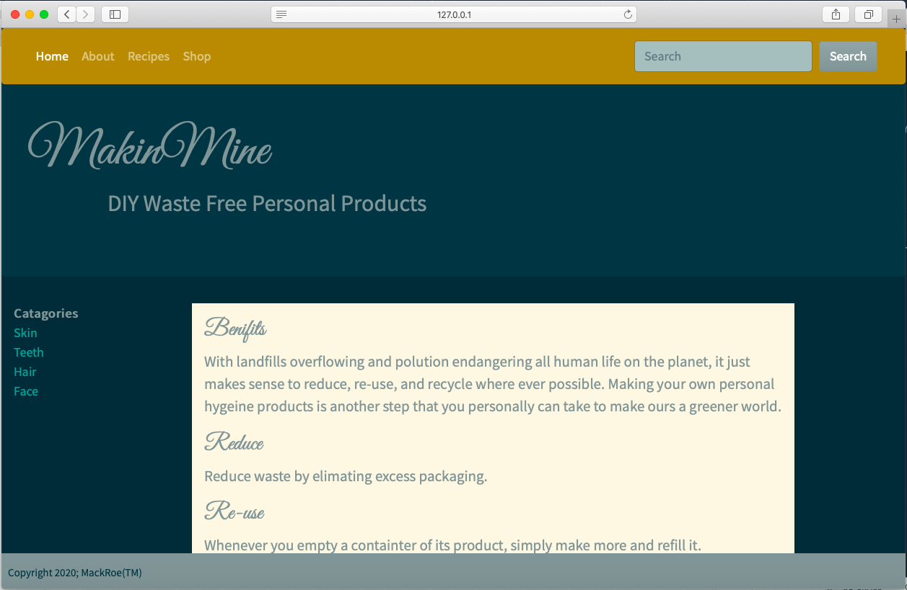

## Winter 2020 Intensive Project for MakeSchool

# MakinMine

A website that allows users to view and share DIY 'no waste' personal products.

User can add and delete product recipes.

### Getting Started

Clone repo. cd into the `mysite` directory. In the terminal window, enter the following: `python3 manage.py runserver`.

You should see a message that says: `Starting development server at http://127.0.0.1:8000/`

Go to the url in your browser to view the site.
